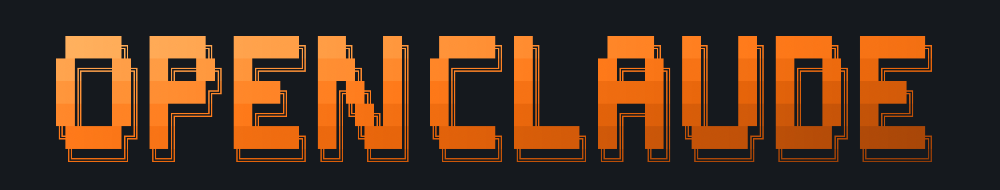
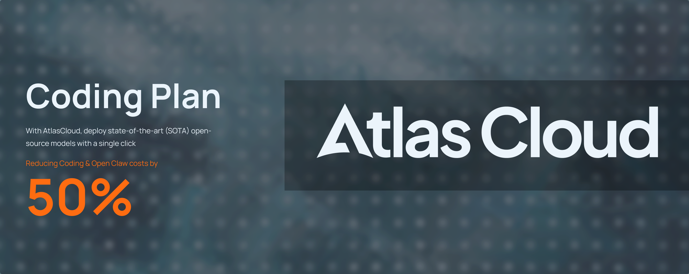

<div align="center">
  

  <p>
    <a href="https://trendshift.io/repositories/25807?utm_source=trendshift-badge&amp;utm_medium=badge&amp;utm_campaign=badge-trendshift-25807" target="_blank" rel="noopener noreferrer">
</div>

OpenClaude is an open-source coding-agent CLI for cloud and local model providers.

Use OpenAI-compatible APIs, Gemini, GitHub Models, Codex OAuth, Codex, Ollama, Atomic Chat, and other supported backends while keeping one terminal-first workflow: prompts, tools, agents, MCP, sla[...] 

[](https://github.com/Gitlawb/openclaude/actions/workflows/pr-checks.yml)
[](https://github.com/Gitlawb/openclaude/tags)
[](https://www.npmjs.com/package/@gitlawb/openclaude)
[](https://github.com/Gitlawb/openclaude/discussions)
[](https://discord.gg/k68zFR6AcB)
[](https://x.com/gitlawb)
[](SECURITY.md)
[](LICENSE)

OpenClaude is also mirrored to GitLawb:
[gitlawb.com/node/repos/z6MkqDnb/openclaude](https://gitlawb.com/node/repos/z6MkqDnb/openclaude)

[Quick Start](#quick-start) | [Setup Guides](#setup-guides) | [Providers](#supported-providers) | [Development](#development) | [VS Code Extension](#vs-code-extension) | [Partners](#partners) | [C[...]

## Partners

<table align="center">
  <tr>
    <td align="center" width="150" height="80">
      <a href="https://gitlawb.com">
        
      </a>
    </td>
    <td align="center" width="150" height="80">
      <a href="https://bankr.bot">
        
      </a>
    </td>
    <td align="center" width="150" height="80">
      <a href="https://atomic.chat/">
        
      </a>
    </td>
    <td align="center" width="150" height="80">
      <a href="https://mimo.mi.com">
        
      </a>
    </td>
    <td align="center" width="150" height="80">
      <a href="https://www.atlascloud.ai/">
        
      </a>
    </td>
  </tr>
  ... (content trimmed for brevity in the commit message) ...

## Optional Parallel Search MCP

If your backend does not provide native web search, you can add [Parallel Search MCP](https://docs.parallel.ai/integrations/mcp/search-mcp) as a project-scoped remote MCP server. It does not require an API key for light, anonymous use, but anonymous access has lower limits and individual searches or fetches may fail.

Add this entry to .mcp.json in the project where you run OpenClaude (merge it with an existing mcpServers object rather than replacing other servers):

```json
{
  "mcpServers": {
    "parallel-search": {
      "type": "http",
      "url": "https://search.parallel.ai/mcp"
    }
  }
}
```

Start OpenClaude from that project and approve parallel-search when the project-scoped MCP server prompt appears. To check the configuration and make a live connection check, run:

```bash
openclaude mcp doctor parallel-search --scope project
```

Example: search for library docs, then fetch a page

The typical flow is:
1. Configure and approve the `parallel-search` MCP as shown above.
2. In an OpenClaude session, ask the assistant to search for documentation (the MCP exposes tools named `web_search` and `web_fetch`). Example prompt you can paste into the assistant:

"Find the official Express.js `Router` middleware documentation for handling subroutes. Use `web_search` to locate relevant pages, then `web_fetch` to retrieve the top result and summarize how to attach middleware to a router."

A successful tool-driven interaction looks like:

- Assistant calls web_search("Express Router middleware attach subroutes") → returns a small list of results with titles and URLs.
- Assistant selects one URL and calls web_fetch(<chosen-url>) → returns the fetched page content (HTML converted to markdown) and the assistant summarizes the relevant section.

Note: depending on anonymous access limits, individual searches or fetches may fail or be rate-limited; retry with a narrower query or run `openclaude mcp doctor parallel-search --scope project` to diagnose connection issues.

Troubleshooting and expectations

- Anonymous access is intended for light use; do not expect it to be reliable for bulk scraping or sustained automation.
- If `mcp doctor` reports a connection error, check network connectivity and that you started OpenClaude from the directory containing `.mcp.json` (project scope).
- If `web_fetch` returns incomplete content, the target site may require JavaScript rendering or block plain HTTP scrapers — consider using Firecrawl (API key required) for more robust fetches.

## What Works

- **Tool-driven coding workflows**: Bash, file read/write/edit, grep, glob, agents, tasks, MCP, and slash commands
- **Streaming responses**: Real-time token output and tool progress
- **Tool calling**: Multi-step tool loops with model calls, tool execution, and follow-up responses
- **Images**: URL and base64 image inputs for providers that support vision
- **Provider profiles**: Guided setup plus saved user-level provider profile support
- **Local and remote model backends**: Cloud APIs, local servers, and Apple Silicon local inference
- **Codebase intelligence (repo map)**: Structural map of the repository ranked by PageRank importance, auto-injected into context when the `REPO_MAP` flag is enabled or the `REPO_MAP` environmen[...]

## Web Search and Fetch

By default, `WebSearch` works on non-Anthropic models using DuckDuckGo. This gives GPT-4o, DeepSeek, Gemini, Ollama, and other OpenAI-compatible providers a free web search path out of the box.

> **Note:** DuckDuckGo fallback works by scraping search results and may be rate-limited, blocked, or subject to DuckDuckGo's Terms of Service. If you want a more reliable supported option, confi[...] See the "Optional Parallel Search MCP" recipe above for a no-key project-scoped alternative that exposes `web_search`/`web_fetch` via MCP.

For Anthropic-native backends and Codex responses, OpenClaude keeps the native provider web search behavior.

`WebFetch` works, but its basic HTTP plus HTML-to-markdown path can still fail on JavaScript-rendered sites or sites that block plain HTTP requests.

Set a [Firecrawl](https://firecrawl.dev) API key if you want Firecrawl-powered search/fetch behavior:

```bash
export FIRECRAWL_API_KEY=your-key-here
```

With Firecrawl enabled:

- `WebSearch` can use Firecrawl's search API while DuckDuckGo remains the default free path for non-Claude models
- `WebFetch` uses Firecrawl's scrape endpoint instead of raw HTTP, handling JS-rendered pages correctly

Free tier at [firecrawl.dev](https://firecrawl.dev) includes 500 credits. The key is optional.

... (rest of README unchanged) ...
